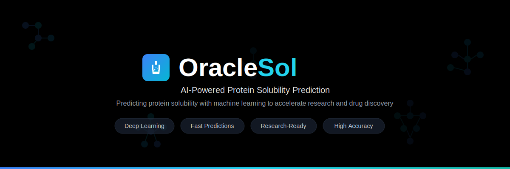
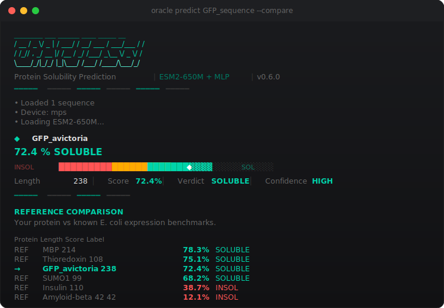

@@ -1,147 +1,74 @@
<p align="center">
  
</p>

<p align="center">
  <a href="https://github.com/61-Keys/oracle-sol/blob/main/LICENSE"></a>
  <a href="https://www.python.org/"></a>
  <a href="https://huggingface.co/spaces/AsutosH26/Oracle-Sol"></a>
  
  
</p>

<p align="center">
  Predict E. coli protein solubility from sequence alone.<br/>
  Frozen ESM2-650M embeddings + trained MLP head. 2.8 MB weights. Runs on CPU.
</p>

---

## Quick Start

```bash
# Install
pip install git+https://github.com/61-Keys/oracle-sol.git

# Predict a protein
oracle predict MSKGEELFTGVVPILVELDGDVNGHKFSVSGEGEGDATYGKLTLK

# Batch from FASTA
oracle predict designs.fasta --rank

# Compare against known references (GFP, MBP, insulin, etc.)
oracle predict MVKVYAPASS... --compare

# Per-residue solubility heatmap
oracle predict MVKVYAPASS... --residues
```

<p align="center">
  
</p>

## Why

You design a protein with RFdiffusion + ProteinMPNN + AlphaFold. It looks perfect in silico. You send it to the wet lab. Three weeks and $2,000 later: **insoluble aggregate**. Failure rates are 30-70%.

ORACLE-Sol predicts whether your protein will actually be soluble when expressed in E. coli, *before* you spend time and money on synthesis. It runs in seconds on a laptop.

## How It Works

```
Your sequence
      |
      v
 ESM2-650M (frozen)     # 650M parameter protein language model
      |                  # extracts deep evolutionary features
      v
 CLS embedding [1280]   # single vector per protein
      |
      v
 MLP head (2.8 MB)      # trained on 70K real experimental outcomes
      |
      v
 P(soluble) score        # 0-100% with confidence level
```

The model was trained on the UESolDS dataset (70,031 E. coli proteins with real wet-lab solubility labels from TargetTrack), not synthetic or computed labels.

## Python API

```python
from oracle_sol import predict_solubility

results = predict_solubility([
    "MSKGEELFTGVVPILVELDGDVNGHKFSVSGEGEGDATYGKLTLK",
    "DAEFRHDSGYEVHHQKLVFFAEDVGSNKGAIIGLMVGGVVIA",
])

for r in results:
    print(f"{r.name}: {r.score_pct} ({r.label}, {r.confidence} confidence)")
```

## CLI Commands

| Command | What it does |
|---|---|
| `oracle predict SEQUENCE` | Predict solubility for a single protein |
| `oracle predict file.fasta` | Batch prediction from FASTA |
| `oracle predict file.fasta --rank` | Ranked table sorted by score |
| `oracle predict SEQ --compare` | Compare against 8 reference proteins |
| `oracle predict SEQ --residues` | Per-residue contribution heatmap |
| `oracle predict file.fasta -o results.csv` | Export to CSV |
| `oracle predict SEQ --quiet` | Minimal output (pipeable) |
| `oracle info` | Model card + reference proteins |

## Performance

| Metric | ORACLE-Sol | PLM_Sol (2024 SOTA) |
|---|---|---|
| Accuracy | 71.9% | 73.0% |
| MCC | 0.450 | 0.469 |
| Training data | 70K proteins | 70K proteins |
| Model size | 2.8 MB head | not published |
| Backbone | ESM2-650M (frozen) | ESM2-650M (frozen) |

The accuracy ceiling across all published methods is approximately 77% / 0.50 MCC, constrained by label noise in the experimental data — not by model capacity. Every method plateaus here.

## How to Read the Output

**Score (0-100%):** Probability of soluble expression in E. coli. Higher = more likely soluble.

**Confidence levels:**
- **HIGH** — score is far from the decision boundary (>80% or <20%). Strong signal.
- **MEDIUM** — moderate certainty (65-80% or 20-35%).
- **LOW** — near the boundary (35-65%). Treat with caution.

**Residue heatmap:** Shows which regions of your protein contribute to or detract from predicted solubility. Green = stabilizing, red = destabilizing. Useful for identifying problematic regions in designed proteins.

## Requirements

- Python 3.10+
- ~3 GB RAM (for ESM2-650M)
- CPU works fine (~2s per protein). GPU optional for speed.
- No internet needed after first run (ESM2 downloads once from HuggingFace Hub).

## License

MIT. Use it however you want.

## Citation

If ORACLE-Sol is useful in your research:

```bibtex
@software{oracle_sol,
  author = {Rath, Asutosh},
  title = {ORACLE-Sol: Protein Solubility Prediction with ESM2},
  year = {2026},
  url = {https://github.com/61-Keys/oracle-sol}
}
```

---

<p align="center">
  <sub>Built by <a href="https://github.com/61-Keys">61-Keys</a></sub>
</p>
